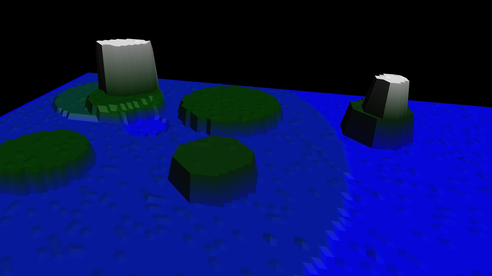

# Surface building

procedural generation, includes height based colours and auto-locating objects.

using [X_ITE](http://create3000.de/x_ite).

<!--
Surface Prototype

Adds to an Elevationgrid node a series of procedurally generated height adjustments, some random height noise, and/or some height determined colouring. This allows the simple creation of enough apparent complexity for a realistic landscape surface, with very little data. This proto can also animate the grid, as a Sine function, to create a moving sea surface etc.
An event can return the current 3D location and orientation of any location on the surface, given its 2D coordinate, so an object can be easily placed on a randomly generated surface at render time, even dynamically when the surface is being animated.
Overview

Althought its the points within a perfect circle that are height altered, the square nature of the elevationgrid makes for a 'rough' look.
-->
