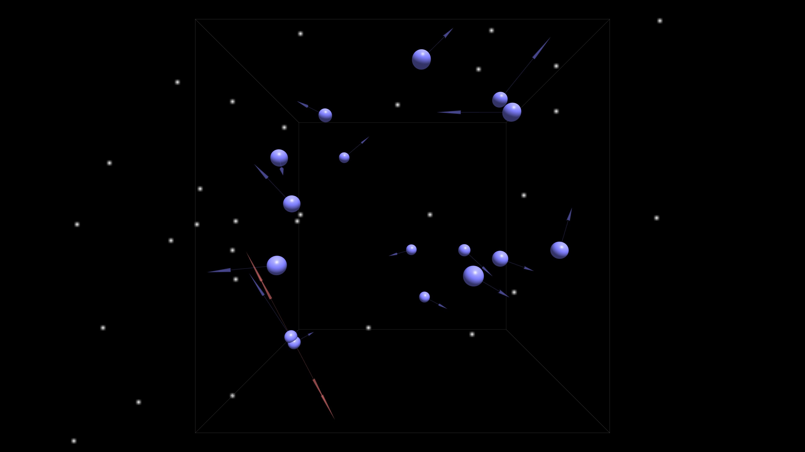

* 

using [X_ITE](http://create3000.de/x_ite).

# Features

## Arrow vector quantities
	blue = velocity (single headed)
	red = acceleration (double headed)

## Bullet time
	When calculation takes longer than frame rate, rate is reduced until accurate. 
	A Faster PC results in less Bullet time.
	
## Chaos
	Even though always starting the same, over time the Butterfly Effect results in runs diverging.