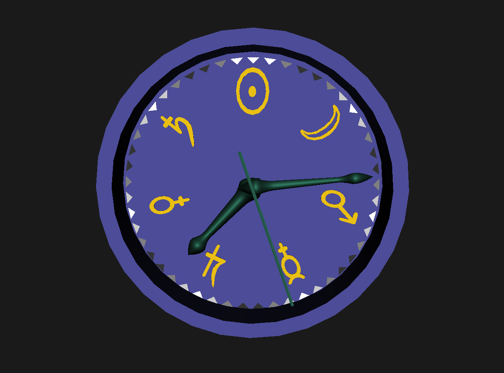

Clock based on the number seven rather than twelve.

# telling the time

clock face has 7 'day' divisions each with 7 triangles.

## Hands

* short:- 1 rotation a week (week day glyphs shown)
notice the triangle brightness shows day/night.
* long :- 7 rotations a day.
* thin :- 343 (7x7x7) rotations a day.

## Convertions to base 12 clock:

* long hand: each 'day' division about 1/2 an hour.
* thin hand: each rotation about 4 mins.
* thin hand: each triangle about 5 secs.
